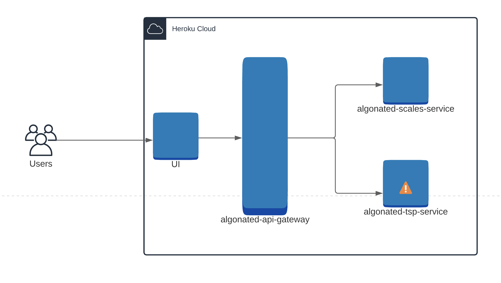
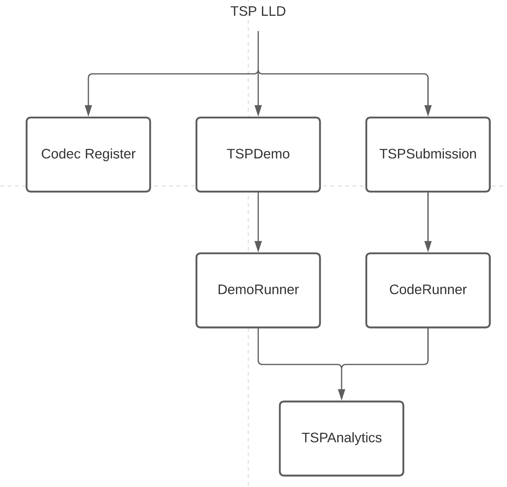

# algonated-tsp-service


The algonated-tsp-service is part of a larger project Algonated. This service can be used to compile and run java code
that is constrained to a specific format.

Algonated is short for Algorithms Animated. This was my final year project in the Brunel University Computer Science
Degree. Algonated is meant to be a platform that can be used by anyone to write algorithms in Java to solve well-known
heuristic search problems like
[The Scales Problem](https://www.mathmammoth.com/preview/balance_problems.pdf)
and [The Travelling Salesman Problem](https://en.wikipedia.org/wiki/Travelling_salesman_problem). This project has space
for expansion and more exercises will be added in due to time.

## High-level diagram



## Low-level diagram



## Installation

```shell
mvn clean package
java -jar target/algonated-tsp-service-x.x.jar
```

## Usage

### Exercise Submission Endpoint

Through this endpoint you can submit your java code as a string and it will be compiled and executed.

#### Request

```shell
curl --location --request POST 'https://algonated-tsp-service.herokuapp.com/exercise/submit/tsp' \
--header 'Content-Type: application/json' \
--data-raw '{
    "className": "TSPProblem",
    "packageName": "com.exercise",
    "methodToCall": "runTSP",
    "iterations": 5,
    "importsAllowed": [],
    "illegalMethods": [],
    "code": "import java.util.ArrayList;\nimport java.util.List;\n\npublic class TSPProblem {\n    private List<List<Integer>> solutions = new ArrayList<>();\n\n    public List<Integer> runTSP(double[][] distances, int iterations) {\n        return List.of(1,2,3,4,5);\n    }\n\n}\n",
    "distances": [
        [0, 1.0, 2.0],
        [1.0, 0.0, 3.0],
        [2.0, 3.0, 0]
    ]
}'
```

#### Response

```json
{
  "consoleOutput": "Compile and Run was a success",
  "result": [
    1,
    2,
    3,
    4,
    5
  ],
  "data": [
    [
      0,
      1.0,
      2.0
    ],
    [
      1.0,
      0.0,
      3.0
    ],
    [
      2.0,
      3.0,
      0
    ]
  ],
  "summary": {
    "iterations": 5,
    "timeRun": 0.0,
    "fitness": -1.0,
    "efficacy": -1.0
  },
  "solutions": [],
  "isSuccess": true
}
```

### Demo Request Endpoint

The demo endpoint allows the user to execute a variety of pre-defined algorithms. Some of them include:

* Random Mutation Hill Climbing
* Random Restart Hill Climbing
* Simulated Annealing
* Stochastic Search

#### Request

```shell
curl --location --request POST 'https://algonated-tsp-service.herokuapp.com/exercise/demo/tsp' \
--header 'Content-Type: application/json' \
--data-raw '{
    "algorithm": "sa",
    "iterations": 1,
    "temperature": 100.0,
    "coolingRate": 5.3,
    "distances": [
        [0, 1.0, 2.0],
        [1.0, 0.0, 3.0],
        [2.0, 3.0, 0]
    ]
}'
```

#### Response

```json
{
  "consoleOutput": "Your Demo is ready!",
  "result": [
    2,
    0,
    1
  ],
  "distances": [
    [
      0,
      1.0,
      2.0
    ],
    [
      1.0,
      0.0,
      3.0
    ],
    [
      2.0,
      3.0,
      0
    ]
  ],
  "summary": {
    "iterations": 1,
    "timeRun": 0.0,
    "fitness": 6.0,
    "efficacy": -1.0
  },
  "solutions": [
    [
      2,
      0,
      1
    ]
  ],
  "isSuccess": true
}
```

## Contributing

Pull requests are welcome. For major changes, please open an issue first to discuss what you would like to change.

Please make sure to update tests as appropriate.

## License

```text
MIT License

Copyright (c) 2021 Dercio Daio

Permission is hereby granted, free of charge, to any person obtaining a copy
of this software and associated documentation files (the "Software"), to deal
in the Software without restriction, including without limitation the rights
to use, copy, modify, merge, publish, distribute, sublicense, and/or sell
copies of the Software, and to permit persons to whom the Software is
furnished to do so, subject to the following conditions:

The above copyright notice and this permission notice shall be included in all
copies or substantial portions of the Software.

THE SOFTWARE IS PROVIDED "AS IS", WITHOUT WARRANTY OF ANY KIND, EXPRESS OR
IMPLIED, INCLUDING BUT NOT LIMITED TO THE WARRANTIES OF MERCHANTABILITY,
FITNESS FOR A PARTICULAR PURPOSE AND NONINFRINGEMENT. IN NO EVENT SHALL THE
AUTHORS OR COPYRIGHT HOLDERS BE LIABLE FOR ANY CLAIM, DAMAGES OR OTHER
LIABILITY, WHETHER IN AN ACTION OF CONTRACT, TORT OR OTHERWISE, ARISING FROM,
OUT OF OR IN CONNECTION WITH THE SOFTWARE OR THE USE OR OTHER DEALINGS IN THE
SOFTWARE.
```
